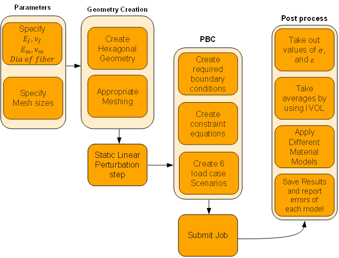

# Repository Description

## Overview
Implementing periodic boundary conditions in Abaqus manually can be a time-consuming task, particularly when establishing connections between nodes and their distinct degrees of freedom across opposite faces. To streamline this process, we present a custom Abaqus plugin that automates the implementation of periodic boundary conditions using homogenization theory to derive effective material properties.

## Usage
The plugin operates through six key steps:

1. **Parameter Specification:** Users define parameters for fiber and matrix materials, along with Representative Volume Element (RVE) dimensions.
2. **Geometry Creation:** The plugin generates the RVE geometry based on specified parameters and creates a mesh ensuring consistent node positions on opposite faces.
3. **Static Linear Perturbation:** The plugin defines a static linear perturbation step.
4. **Periodic Boundary Conditions (PBC):** Essential boundary conditions are set up using a pair function, establishing 'master' and 'slave' nodes on opposite faces.
5. **Job Submission:** The plugin submits the job for analysis.
6. **Post-Processing:** Results are post-processed, including material homogenization scenarios and the derivation of simplified material models.

## Parameters
In the parameter section, users specify material properties, RVE dimensions, and utilize a unique approach to derive RVE dimensions based on the number of fibers, fiber diameter, and volume fraction of the fiber.

## Geometry Creation Module
This module focuses on creating RVE geometry based on specified dimensions and fiber diameter, including mesh generation for subsequent analysis.

## Analysis Step
The primary analysis involves a static linear perturbation, defining field output variables such as strain, logarithmic strain, total strain, stress, displacements, and integration point volume.

## Periodic Boundary Condition (PBC) Module
This module establishes essential boundary conditions using a pair function, defining 'master' and 'slave' nodes on opposite faces.

## Post-Processing
The post-processing module evaluates material homogenization scenarios, deriving simplified material models and measuring errors to assess approximation quality. Results are summarized in CSV files for further analysis.

## Running the Code
1. Change Abaqus directory to the plugin directory (`File->Set Work Directory..-> Plugin_directory`).
2. Run the main file (`File->Run script...->main.py`).
3. Edit material properties in `materialProperties.json`.
4. Results are saved in `*.txt` and `*.csv` files, with model comparisons in `stiffnessMatrices\hexa_model_micro_scale\hexa_model_micro_scale_MyAvgMethod_homogenzation_errors.csv`.

This tool automates the evaluation of homogenization scenarios, aiding engineers and researchers in developing accurate and computationally efficient material models for complex simulations.